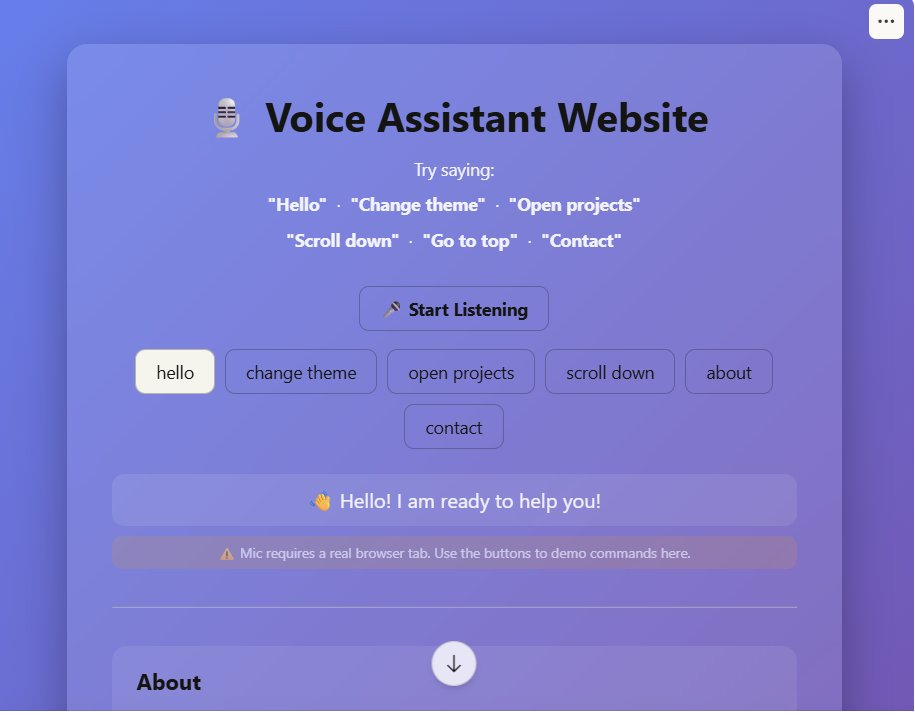
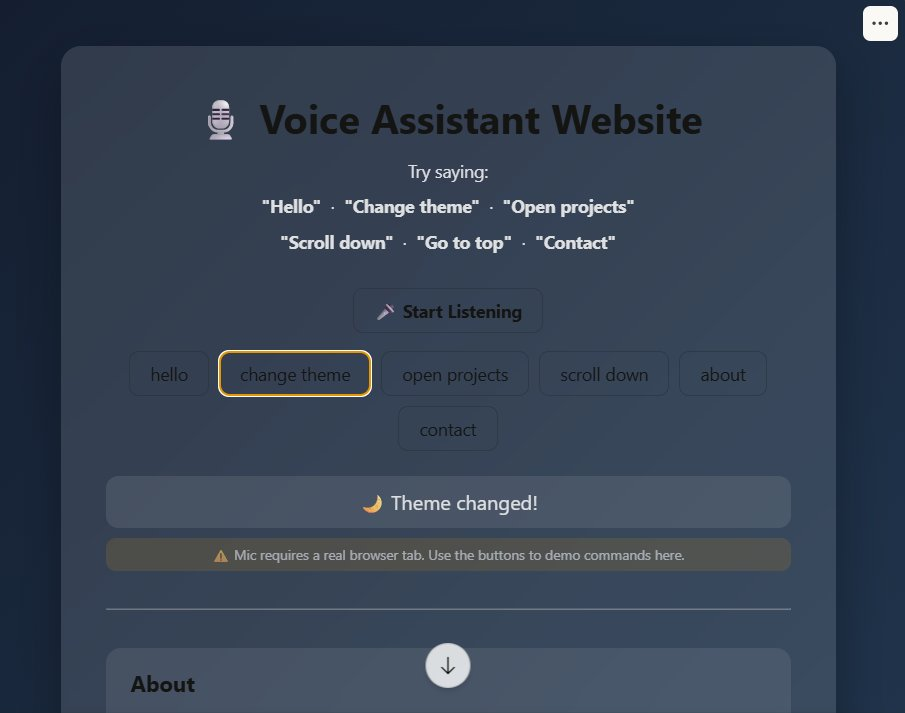
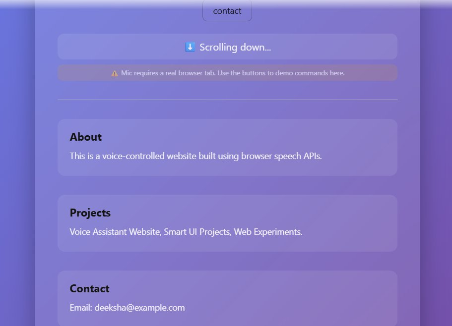
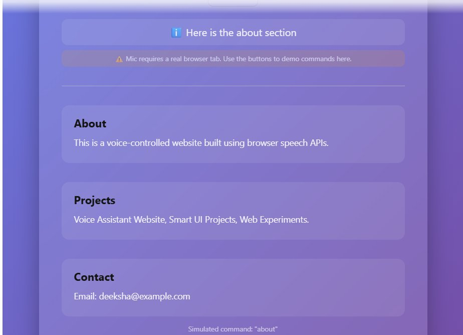

# 🎙️ Voice Controlled Web Assistant

## 🌐 Live Demo

https://deekshabhati2018.github.io/Voice-Controlled-Web-Assistant/
# 🎙️ Voice Controlled Web Assistant

A browser-based voice assistant built with pure **JavaScript**, **HTML5**, and the **Web Speech API** — no libraries, no frameworks. Speak commands to navigate the page, switch themes, scroll, and get spoken responses back in real time.

---


## 🖼️ Screenshots

### Default Theme — Hello Command

> Purple gradient UI — "Hello" command responded with 👋 "Hello! I am ready to help you!"

### Dark Theme — After "Change Theme" Command

> 🌙 Dark mode activated instantly via voice — "Theme changed!" confirmation in output

### Scroll Down — Sections View

> ⬇️ "Scroll down" command executes smooth scroll — About, Projects, Contact sections revealed

### About Section Navigation

> ℹ️ "About" command scrolls directly to the About section with spoken confirmation

---

## 🛠️ Tech Stack

| Component | Technology |
|---|---|
| Language | JavaScript (Vanilla), HTML5, CSS3 |
| Speech Input | Web Speech API — `SpeechRecognition` |
| Speech Output | Web Speech API — `SpeechSynthesis` |
| Styling | CSS gradients, glassmorphism, transitions |
| Dependencies | None — zero libraries, zero frameworks |

---

## ✨ Features

- ✅ Real-time voice command recognition via browser mic
- ✅ 15+ supported voice commands
- ✅ Text-to-speech — assistant speaks every response aloud
- ✅ Dark / light theme toggle by voice (`"Change theme"`)
- ✅ Smooth scroll navigation by voice (`"Scroll down"`, `"Go to top"`)
- ✅ Direct section jump — About, Projects, Contact by voice
- ✅ Under 1-second command response time
- ✅ Glassmorphism card UI with animated mic button
- ✅ Zero dependencies — pure HTML + CSS + JS

---

## 🎤 Supported Voice Commands

| Command | Action |
|---|---|
| `"Hello"` | Assistant greets and confirms ready |
| `"Change theme"` | Toggles dark / light mode |
| `"Open projects"` / `"Show projects"` | Scrolls to Projects section |
| `"About"` / `"Who are you"` | Scrolls to About section |
| `"Contact"` / `"Email"` | Scrolls to Contact section |
| `"Scroll down"` | Smooth scrolls page down 400px |
| `"Scroll up"` | Smooth scrolls page up 400px |
| `"Go to top"` | Returns to top of page |

---

## 🗂️ Project Structure

```
Voice-Controlled-Web-Assistant/
│
├── index.html     # App layout — sections (About, Projects, Contact)
├── style.css      # Gradient theme, glassmorphism, dark mode toggle
├── script.js      # SpeechRecognition + command handler + SpeechSynthesis
└── README.md
```

---

## ⚙️ How It Works

```
User clicks "Start Listening"
        ↓
SpeechRecognition API activates mic
        ↓
Browser transcribes speech → string
        ↓
handleCommand() matches keywords
        ↓
DOM action runs (scroll / theme / navigate)
        ↓
SpeechSynthesis speaks confirmation aloud
        ↓
Output box updates with result
```

---

## 🚀 Getting Started

No install needed — runs entirely in the browser.

### 1. Clone the repository

```bash
git clone https://github.com/Deekshabhati2018/Voice-Controlled-Web-Assistant.git
cd Voice-Controlled-Web-Assistant
```

### 2. Open in browser

Simply open `index.html` in your browser, or use **VS Code Live Server** for the best experience.

### 3. Allow microphone access

When prompted, click **Allow**. Then click **🎤 Start Listening** and speak a command.

> Best supported on **Google Chrome** or **Microsoft Edge**.

---

## 🌐 Browser Compatibility

| Browser | Speech Input | Speech Output |
|---|---|---|
| Chrome | ✅ Full | ✅ |
| Edge | ✅ Full | ✅ |
| Firefox | ⚠️ Limited | ✅ |
| Safari | ⚠️ Partial | ✅ |

---

## 🚧 Future Improvements

- [ ] Add more commands (open URL, tell time/date, web search)
- [ ] Visual mic waveform animation while listening
- [ ] Command history log panel
- [ ] Multi-language support
- [ ] Deploy to GitHub Pages for live demo link

---

## 👩‍💻 Author

**Deeksha Bhati**  
B.Tech CSE @ NIET, Greater Noida | CGPA: 8.7

[](https://linkedin.com/in/deekshabhati910)
[](https://github.com/Deekshabhati2018)
[](https://leetcode.com/_DeekshaBhati_)

---

> ⭐ If this project helped you, consider starring the repo!
